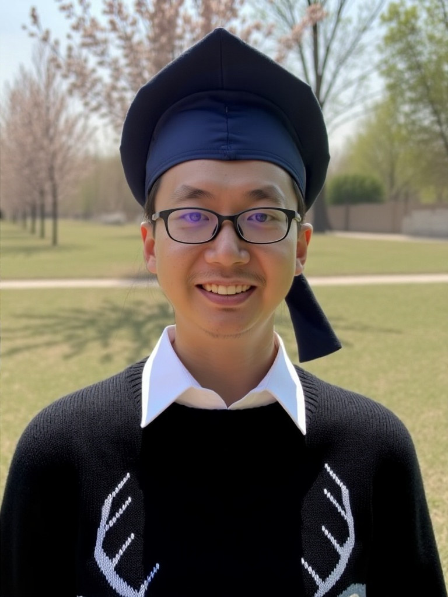
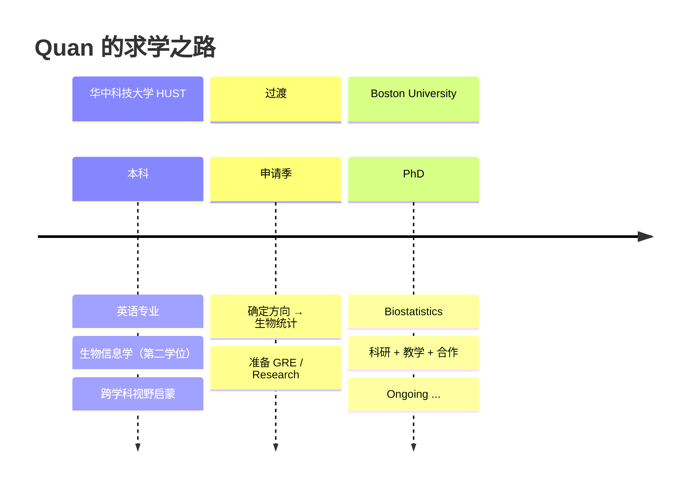

<div align="center">

<!-- 顶部横幅 -->


<!-- 个人照片 -->


<br/>

<!-- 打字效果 -->
<a href="https://github.com/quanxquan">
  
</a>

<!-- 访客统计 + 粉丝 -->
<p>
  
  
  
</p>

</div>

---

## 🌿 关于我 / About Me

```python
class Quan:
    def __init__(self):
        self.name        = "Quan"
        self.username    = "@quanxquan"
        self.education   = [
            "🎓 华中科技大学 HUST — 英语 × 生物信息学 (双学位)",
            "🎓 Boston University — PhD in Biostatistics"
        ]
        self.location    = "Boston, MA → Wuhan, China 🌎"
        self.languages   = ["中文 🇨🇳", "English 🇬🇧", "Python 🐍", "R 📊"]
        self.current     = "Building statistical models for genomic data"

    def say_hi(self):
        print("谢谢访问！Thanks for dropping by — let's collaborate. ✨")

Quan().say_hi()
```

---

## 🧬 研究兴趣 / Research Interests

<table>
  <tr>
    <td align="center" width="25%">
      <br/>
      <b>Genomics</b><br/>
      <sub>Single-cell • Bulk RNA-seq</sub>
    </td>
    <td align="center" width="25%">
      <br/>
      <b>Biostatistics</b><br/>
      <sub>Bayesian • Causal Inference</sub>
    </td>
    <td align="center" width="25%">
      <br/>
      <b>Machine Learning</b><br/>
      <sub>Deep Learning for Bio</sub>
    </td>
    <td align="center" width="25%">
      <br/>
      <b>Scientific Writing</b><br/>
      <sub>双语写作 • Publication</sub>
    </td>
  </tr>
</table>

---

## 🛠 技术栈 / Tech Stack

<div align="center">

**Languages & Stats**  


**Bioinformatics & ML**  


**Workflow**  


</div>

---

## 📈 GitHub 数据 / Stats

<div align="center">
  
  
</div>

<div align="center">
  
</div>

<div align="center">
  
</div>

---

## 🌱 当前在做 / Currently Working On

- 🔬 在 BU 生物统计系开展博士研究：高维基因组数据的统计方法
- 📚 阅读论文：single-cell multi-omics integration
- 🌍 用双语（中/英）记录科研笔记与学习心得
- 🤝 寻找合作者 — 欢迎 Issue / PR / Email 交流！

---

## 🗺 成长路径 / My Journey



---

## 📬 订阅我的更新 / Subscribe

<div align="center">
  <a href="https://quanxquan.github.io/quanxquan/subscribe.html">
    
  </a>
  <p><sub>科研笔记 · 生物统计 · 生信工具 — 不定期更新，随时可退订</sub></p>
</div>

---

## 💬 找到我 / Reach Me

<div align="center">

<a href="mailto:quan@example.com"></a>
<a href="https://github.com/quanxquan"></a>
<a href="#"></a>
<a href="#"></a>

</div>

---

<div align="center">

> *"All models are wrong, but some are useful."* — George E. P. Box


</div>
